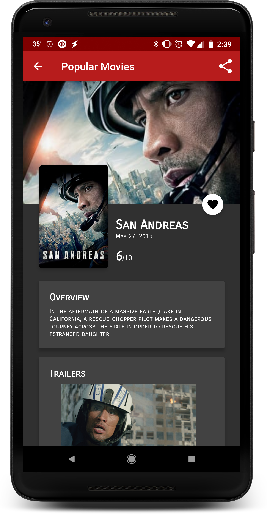

# Popular Movies

## Features
* Discover the most popular and highest rated movies on The MovieDB website
* Save favorite movies locally to allow viewing offline
* Watch movies trailers from YouTube.com
* Read movie trailers posted to The MovieDB website
* Share links to movie trailers with friends

## Screenshots

## Overview
In this project, you’ll build an app to allow users to discover the most popular movies playing.

#### Why this Project?
To become an Android developer, you must know how to bring particular mobile experiences to life. Specifically, you need to know how to build clean and compelling user interfaces (UIs), fetch data from network services, and optimize the experience for various mobile devices. You will hone these fundamental skills in this project.

#### What Will I Learn?
* Fetch data from the Internet with theMovieDB API.
* Use adapters and custom list layouts to populate list views.
* Incorporate libraries to simplify the amount of code you need to write

## Rubric

#### User Interface - Layout
- [x] UI contains an element (e.g., a spinner or settings menu) to toggle the sort order of the movies by: most popular, highest rated.
- [x] Movies are displayed in the main layout via a grid of their corresponding movie poster thumbnails.
- [x] UI contains a screen for displaying the details for a selected movie.
- [x] Movie Details layout contains title, release date, movie poster, vote average, and plot synopsis.
- [x] Movie Details layout contains a section for displaying trailer videos and user reviews.

#### User Interface - Function
- [x] When a user changes the sort criteria (most popular, highest rated, and favorites) the main view gets updated correctly.
- [x] When a movie poster thumbnail is selected, the movie details screen is launched.
- [x] When a trailer is selected, app uses an Intent to launch the trailer.
- [x] In the movies detail screen, a user can tap a button(for example, a star) to mark it as a Favorite.

#### Network API Implementation
- [x] In a background thread, app queries the /movie/popular or /movie/top_rated API for the sort criteria specified in the settings menu.
- [x] App requests for related videos for a selected movie via the /movie/{id}/videos endpoint in a background thread and displays those details when the user selects a movie.
- [x] App requests for user reviews for a selected movie via the /movie/{id}/reviews endpoint in a background thread and displays those details when the user selects a movie.

#### Data Persistence
- [x] The titles and IDs of the user’s favorite movies are stored in a native SQLite database and are exposed via a ContentProvider. This ContentProvider is updated whenever the user favorites or unfavorites a movie. No other persistence libraries are used.
- [x] When the "favorites" setting option is selected, the main view displays the entire favorites collection based on movie ids stored in the ContentProvider.

#### Extra Features
- [x] Extend the favorites ContentProvider to store the movie poster, synopsis, user rating, and release date, and display them even when offline.
- [x] Implement sharing functionality to allow the user to share the first trailer’s YouTube URL from the movie details screen.
